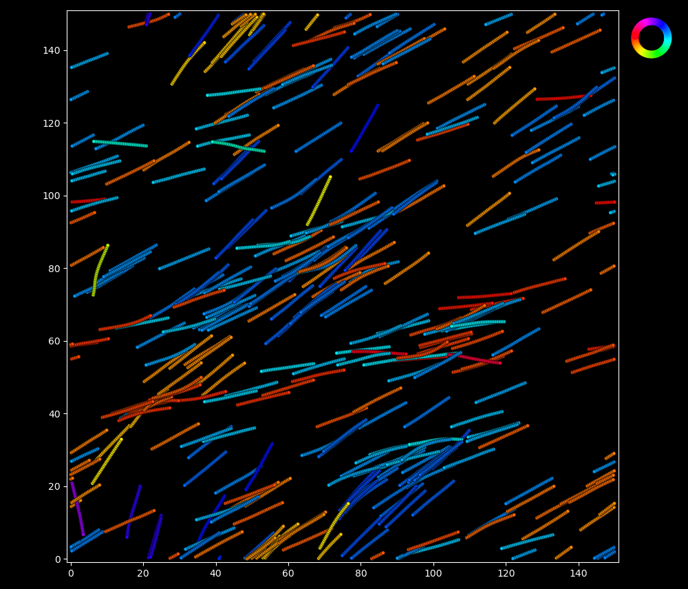
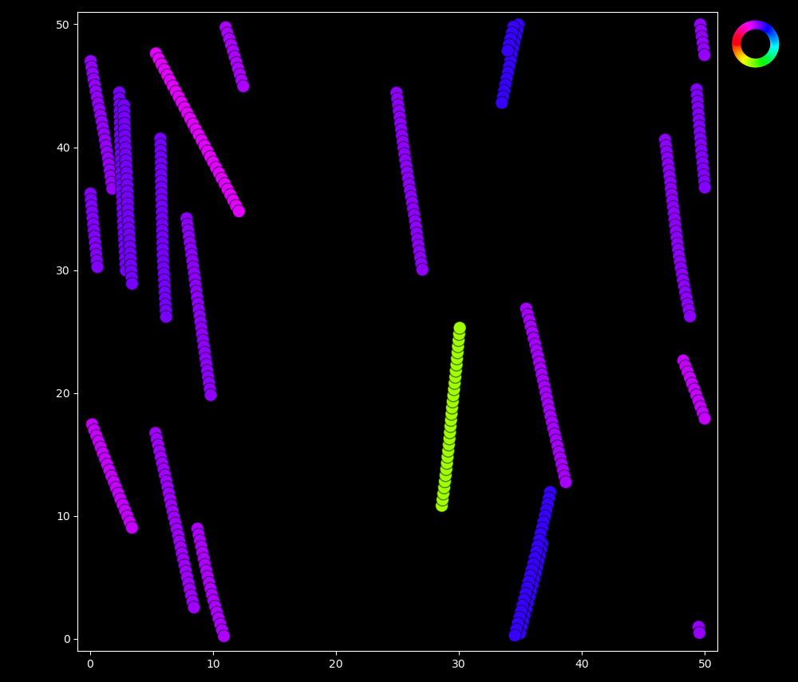
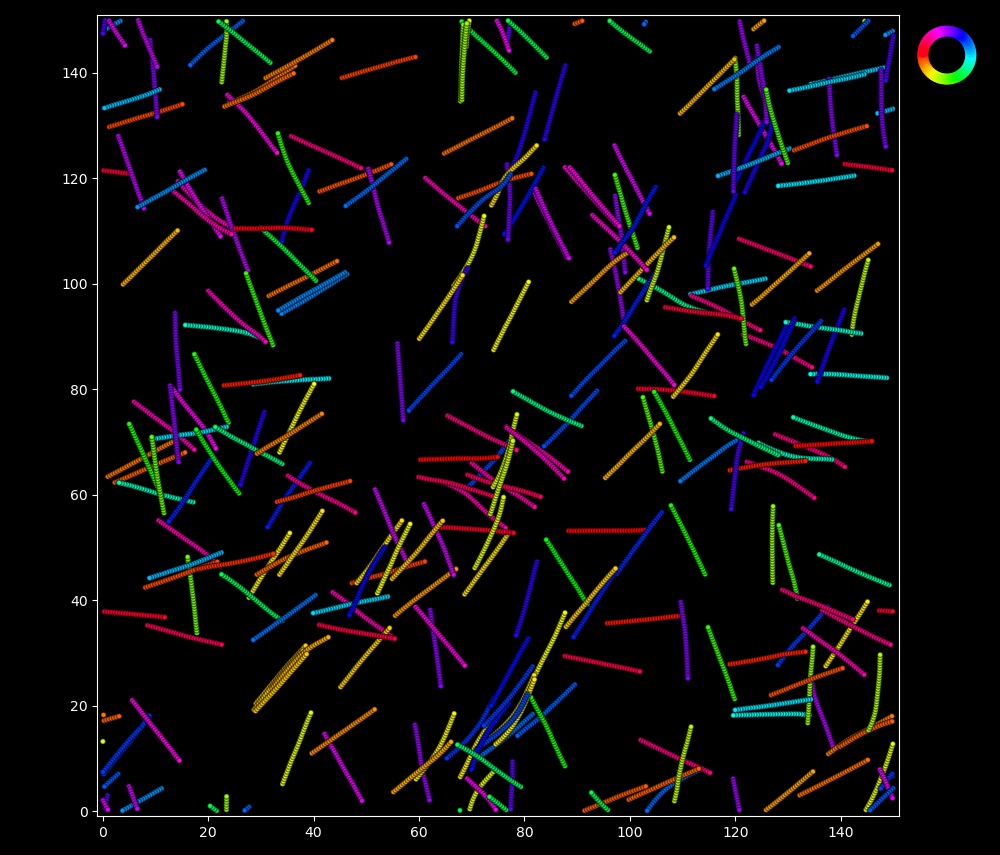
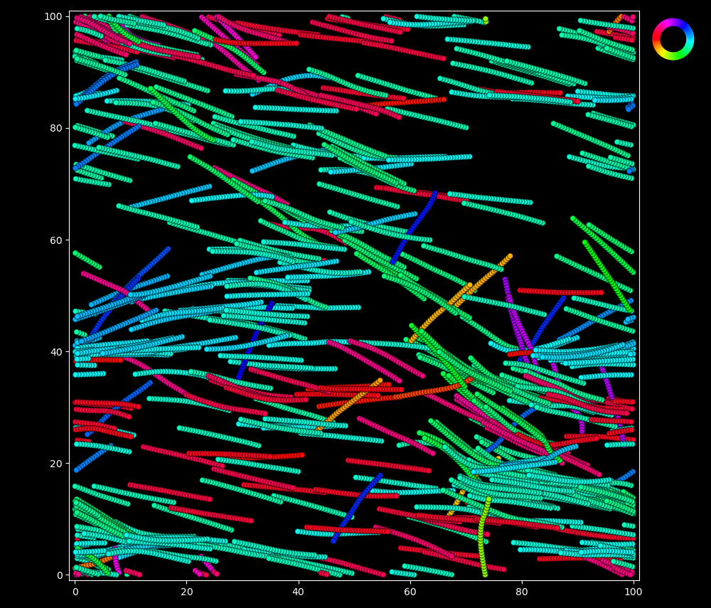

# Supervised Fine-Tuning a Vision Transformer (ViT) with PEFT LoRA for Overlapping Object Counting

## Project Overview
This repository contains the code and setup for fine-tuning a Vision Transformer (ViT) using Parameter-Efficient Fine-Tuning (PEFT) with LoRA (Low-Rank Adaptation). The primary goal is to adapt pre-trained ViT models to an overlapping object counting task (regression) effectively.

Object counting in images with overlapping elements presents unique challenges, such as identifying individual objects in dense and cluttered areas. This project leverages the power of Vision Transformers (ViT) fine-tuned with Parameter-Efficient Fine-Tuning (PEFT) using LoRA to tackle these challenges efficiently.

The project uses custom datasets structured into training, testing, and validation splits (CSV format). The training process has been optimized to ensure effective fine-tuning while maintaining computational efficiency.

## Folder Structure
```
.
├── Code/                       # Contains Jupyter notebooks and scripts for the project
│   └── Finetuning_ViT_LoRA.ipynb  # Main notebook for fine-tuning the ViT model
├── Training_sample/            # A small subset of the Training/ folder for reference on what type of images were used
├── fine_tuned_feature_extractor/ # Folder containing fine-tuned feature extractor
├── fine_tuned_model/           # Folder containing the final fine-tuned model
├── .gitignore                  # Git ignore file
├── LICENSE                     # License information
├── README.md                   # Project documentation
├── output.csv                  # Contains the path to all images in the Training/ folder not included here along with the number of objects in each image
├── test_data.csv               # Testing dataset file contains the test split of image paths and their corresponding labels (number of objects)
├── train_data.csv              # Training dataset file contains the training split of image paths and their corresponding labels (number of objects)
└── val_data.csv                # Validation dataset file contains the validation split of image paths and their corresponding labels (number of objects)
```

> **Note**: The full `Training/` folder containing all images has not been included in this repository due to its large size. If you need access to the full dataset, please contact me, and I can provide it upon request.

## Understanding the Data
The images were obtained from simulations of filaments from my PhD research. These filaments represent microtubules in an in-vitro gliding assay. For reference on what these images mean, please see my paper:

M. G. Athani and D. A. Beller, "Symmetry and stability of orientationally ordered collective motions of self-propelled, semiflexible filaments," Phys. Rev. Res. 6, 023319 (2024). [DOI: 10.1103/PhysRevResearch.6.023319](https://doi.org/10.1103/PhysRevResearch.6.023319)

<figure>
  <div style="display: flex; justify-content: space-around;">
    
    
    
      
  </div>
  <figcaption>Figures: Sample images showing overlapping filaments with varying densities and orientations.</figcaption>
</figure>


### Dataset Details
- **Total number of images**: 3360
  - Training: 2352 images
  - Validation: 504 images
  - Testing: 504 images

The `Training_sample/` folder contains a few images as a sample. It can be seen from these sample images that objects refer to filaments, which can vary in:
- **Color**: Filaments can be in any color.
- **Orientation**: Filaments can have any orientation.
- **Size**: Sizes vary across images.

Another critical feature of this dataset is the presence of **overlaps**, making object counting more challenging. The labels provide the exact number of objects in each image.

- **Range of labels**: [10, 1500]

## Model
This project uses the Vision Transformer (ViT) model `google/vit-base-patch16-224-in21k` from Hugging Face. The classification head is replaced with a regression head since the task is regression-based.

**Fine-Tuning Details**:
- **Trainable Parameters**: 294,912
- **Total Parameters**: 86,094,337
- **Trainable %**: 0.3425%
- **LoRA Target Modules**: ["query", "value"] matrices
- **LoRA Rank (r)**: 8

## Prerequisites
Before you begin, ensure you have the following installed:
- Python 3.8+
- PyTorch
- PEFT library (LoRA support)
- Transformers library

## Implementation
Training is implemented in PyTorch with the following setup:
- **Loss Function**: Mean Squared Error (MSE)
- **Evaluation Metric**: Test Loss and Error Margin

Training, validation, and evaluation are supported by the scripts provided.

## Results
- **Best Test Loss**: 0.002724
- **Error Margin**: ±43 filaments
- **Mean absolute percentage error**: ~20%

## Future Enhancements in techniques
- Explore additional PEFT techniques.
- Automate hyperparameter tuning.

## Future research direction and questions
- Now that we have been able to find the number of filaments in simulations, we want to explore if the model can be used on experimental data where finding the surface density of filaments is very important for research questions.
- The next bigger question relavent for reseach is to find the number of overlapping events in the images.

## Acknowledgments
This project builds on research conducted during my PhD studies. Special thanks to all my collaborators.

## Contact
For questions or access to the full `Training/` folder, reach out via:
- **Email**: athanimadhu[at]gmail[dot]com

